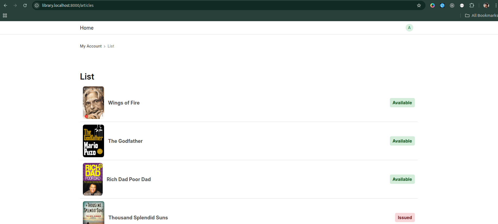
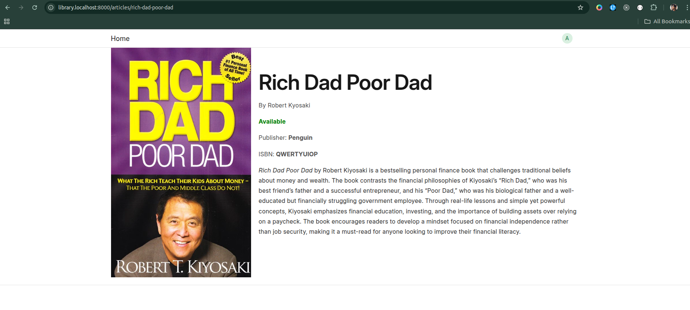

# Library Management System

This project is a Library Management System built using the [Frappe Framework](https://frappeframework.com/). It follows the [Frappe Library Management Tutorial](https://docs.frappe.io/framework/user/en/tutorial) to demonstrate how to create a custom app within Frappe.

## Overview

The Library Management System is designed to:
- Manage a catalog of books.
- Track author details.
- Handle library transactions like borrowing and returning books.

## Data Models

The system includes the following key models:

- **Article:** Represents books or similar items that can be rented.
- **Library Member:** Users who are subscribed to a membership.
- **Library Transaction:** Records the issue or return of an article.
- **Library Membership:** Documents that represent active memberships of Library Members.
- **Library Settings:** Configuration for loan periods and maximum number of articles that can be issued simultaneously.

## Key Features

- **Book Management:** Books can be created, and managed within the system's catalog.
- **Issue and Return Process:** Library members can borrow books, which are tracked through the transaction system.
- **Membership Plans:** The system supports membership plan with configurable durations.
- 
## Screenshots

## Prerequisites

- **Python 3.x**
- **Frappe Bench CLI**
- **Node.js and npm** (for asset compilation)
- **Redis and MariaDB/MySQL** (for caching and database management)

